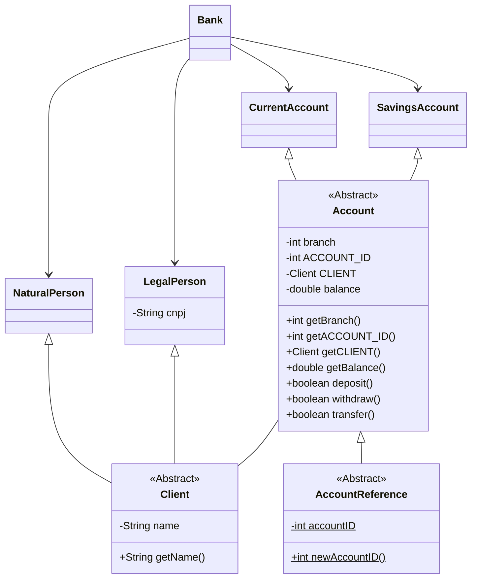

# Desafio DIO, Criando Banco Digital com Java OO
Desafio: Desenvolver um banco digital que ofereça aos clientes dois tipos de contas (corrente e poupança), que possuam as funcionalidades de depósito, saque e transferência, levando em consideração a **Abstração, Encapsulamento, Herança e Polimorfismo.**

# Projeto
Projeto simplificado com objetivo de apresentar o POO
 - Classe **Banco**
   - Relacionamento entre cliente e conta
 - Classes **PessoaFísica, PessoaJurídica, Cliente**
   - O cliente esta em Herança para algumas operações em que o jurídico pode fazer e o físico não, ex.: Conta Salário em que o depósito só pode ser feito por Jurídicos (não tem a conta salário, pois não pede no desafio, mas achei conveniente separar o cliente em classes e poder usar Herança, Abstração e Polimorfismo)
 - Classes **Conta Corrente, Conta Poupança, Conta**
   - O uso da Herança é para deixar a possibilidade de distinção

# Diagrama UML
